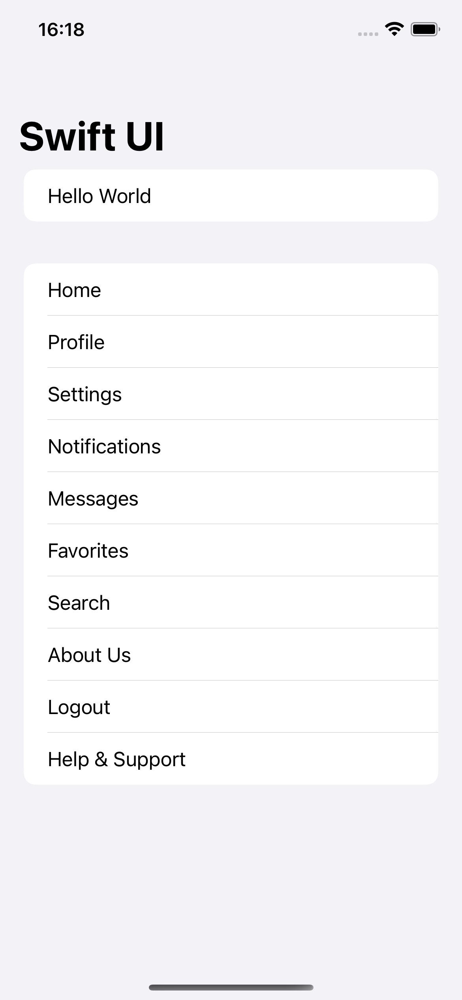

# SwiftUI 100 Days Challenge

## Day 16: Creating Dynamic UI Components

Today's progress includes working on dynamic user interface components in SwiftUI. Below are snapshots and videos demonstrating the topics covered:

### 1. Creating a Form

- Documented screen and images.
- [View Screenshots](docs/screenshots/day16/1)

### 2. Adding a Navigation Bar

- Documented screen and images.
- [View Screenshots](docs/screenshots/day16/2)

### 3. Modifying Program State

- Documented screen and images.
- [View Video](docs/screenshots/day16/3)

### 4. Binding State to User Interface Controls

- Documented screen and images.
- [View Video](docs/screenshots/day16/4)

### 5. Creating Views in a Loop

- Documented screen and images.
- [View Video](docs/screenshots/day16/5)

## How to Access Screenshots and Videos

For detailed screenshots and videos related to each topic, navigate to the "docs/screenshots/day16" directory.

## Requirements
- Xcode 14.0 or later
- Swift 5.3 or later

Feel free to explore the provided materials and dive into the code to understand the concepts better. Happy coding!
